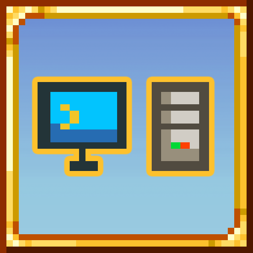

<!-- PROJECT LOGO -->
 

  

  <h3 align="center">Mod Side Icon</h3>

Streamline mod management with instant visual identification of client and server-side mods.

  

    <a href="https://steamcommunity.com/sharedfiles/filedetails/?id=3408391079">Workshop Page</a>
    &middot;
    <a href="https://github.com/emyhrberg/ModSideIcon/issues?q=sort%3Aupdated-desc+is%3Aissue+is%3Aopen">Bug Report</a>
  

